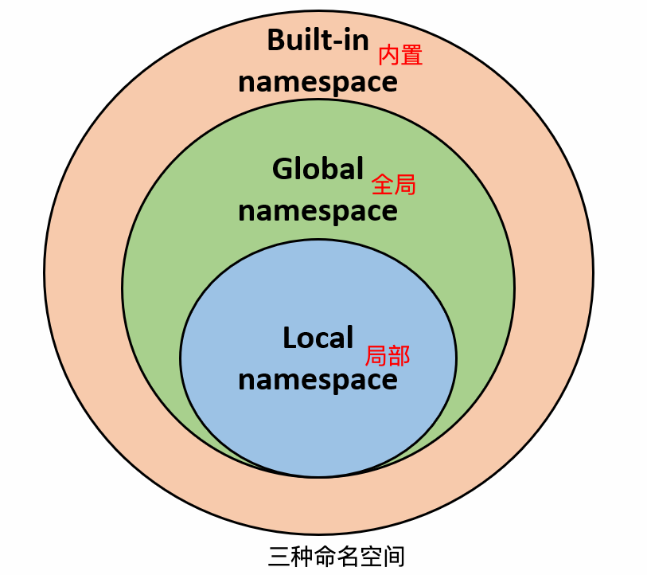

# 在学习和工作过程中，逐步完善的知识点、技术、功能、开发方式等。

1. 基础语法层（基础结构）

   | 模块             | 内容                                                         |
   | ---------------- | ------------------------------------------------------------ |
   | 变量与数据类型   | int, float, str, bool, list, tuple, dict, set                |
   | 运算符           | 算术、比较、逻辑、位运算、成员、身份运算符                   |
   | 控制流程         | `if / elif / else`, `for`, `while`, `break / continue / pass` |
   | 函数             | `def`, `*args`, `**kwargs`, `lambda`, `return`               |
   | 作用域与命名空间 | `LEGB` 原则（Local → Enclosing → Global → Built-in）         |

2. 面向对象层（OOP）

   | 概念             | 说明                                                         |
   | ---------------- | ------------------------------------------------------------ |
   | 类与对象         | `class`, `__init__`, `self`                                  |
   | 封装、继承、多态 | OOP 三大特性                                                 |
   | 魔术方法         | `__str__`, `__repr__`, `__len__`, `__add__`, `__call__`, `__getitem__`, `__iter__` 等 |
   | 类方法/静态方法  | `@classmethod`, `@staticmethod`                              |

3. 数据处理机制（可迭代协议）

   | 概念          | 说明                                                       |
   | ------------- | ---------------------------------------------------------- |
   | Iterable      | 实现 `__iter__()` 的对象（list、tuple、str、dict、set 等） |
   | Iterator      | 实现 `__iter__()` 和 `__next__()`，如 `iter(list)`         |
   | Generator     | 使用 `yield` 的函数，自动实现迭代器协议                    |
   | Comprehension | 列表/集合/字典推导式                                       |

4. 函数进阶 & 装饰器 / 闭包

   | 模块     | 说明                                          |
   | -------- | --------------------------------------------- |
   | 闭包     | 嵌套函数 + 引用外部变量 + 返回内部函数        |
   | 装饰器   | 本质是一个返回函数的函数，用于包装目标函数    |
   | 偏函数   | `functools.partial`                           |
   | 匿名函数 | `lambda`                                      |
   | 高阶函数 | `map`, `filter`, `reduce`, `sorted(key=func)` |

5. 异常与上下文

   | 概念         | 说明                                         |
   | ------------ | -------------------------------------------- |
   | 异常处理     | `try / except / else / finally / raise`      |
   | 自定义异常   | 自定义继承 Exception                         |
   | 上下文管理器 | `with` + 实现 `__enter__` 和 `__exit__` 方法 |
   | 文件操作     | `open(filename, mode)` 配合 `with`           |

6. 模块化与包管理

   | 内容     | 说明                                                         |
   | -------- | ------------------------------------------------------------ |
   | 模块导入 | `import`, `from ... import ...`, `as`                        |
   | 标准库   | `os`, `sys`, `re`, `math`, `datetime`, `json`, `collections` 等 |
   | 虚拟环境 | `venv`, `pipenv`, `poetry`                                   |
   | 包结构   | `__init__.py`, 相对导入、绝对导入                            |

7. 并发编程（异步 / 多线程 / 多进程）

   | 类型         | 说明                                                         |
   | ------------ | ------------------------------------------------------------ |
   | 线程         | `threading.Thread`, `Lock`, `Queue`                          |
   | 进程         | `multiprocessing.Process`, `Pool`                            |
   | 协程（异步） | `async def`, `await`, `asyncio.run()`, `asyncio.create_task()` |
   | 事件循环     | asyncio 的调度机制                                           |
   | GIL          | Python 的全局解释器锁（限制多线程）                          |

8. 设计模式（架构思维）

   | 类型   | 模式名称                         |
   | ------ | -------------------------------- |
   | 创建型 | 单例、工厂、建造者               |
   | 结构型 | 适配器、装饰器、外观             |
   | 行为型 | 策略、观察者、状态、命令、迭代器 |

9. 类型注解与新特性（Python 3.6+）

   | 模块         | 说明                                                         |
   | ------------ | ------------------------------------------------------------ |
   | 类型注解     | `def func(x: int) -> str:`                                   |
   | dataclass    | `@dataclass` 简化类定义                                      |
   | typing       | `List`, `Dict`, `Optional`, `Union`, `Callable`, `Any`, `Literal`, `TypedDict` 等 |
   | 结构模式匹配 | `match / case`（Python 3.10+）                               |

10. 生态模块与实战应用

    | 类别     | 框架与库                           |
    | -------- | ---------------------------------- |
    | Web开发  | FastAPI, Flask, Django             |
    | 数据科学 | NumPy, Pandas, Matplotlib, Seaborn |
    | 机器学习 | scikit-learn, TensorFlow, PyTorch  |
    | 自动化   | Selenium, Requests, BeautifulSoup  |
    | 脚本工具 | Click, Typer, Argparse             |
    | 打包部署 | PyInstaller, Docker, poetry        |

    

📌 附：开发者实战路线建议
```
    1. 基础语法 → 函数 → 面向对象
    2. 掌握 迭代器、生成器、装饰器
    3. 掌握 异常处理 / 上下文管理
    4. 学习 设计模式 + 并发编程
    5. 熟练 类型注解 + 模块化
    6. 构建项目（爬虫、API、数据处理、自动化）
    7. 了解生态库（Web、数据、AI）
    8. 编写高质量代码（测试、重构、部署）
```


### 🍞变量
变量的定义、赋值。

### 🍞标准数据类型
- Number（数字）
- String（字符串）
- bool（布尔类型）
- List（列表）
- Tuple（元组）
- Set（集合）
- Dictionary（字典）

不可变数据（3 个）：Number（数字）、String（字符串）、Tuple（元组）。
可变数据（3 个）：List（列表）、Dictionary（字典）、Set（集合）。

另外还有 collections.deque 比较常用。

### 🍞解释器
Python 解释器可不止一种，有 CPython、IPython、Jython、PyPy 等。

### 🍞语法
- 条件控制、循环语句、推导式、迭代器与生成器、函数、lambda、装饰器

- 函数尽可能带上元信息

- lambda 函数通常与内置函数如 map()、filter()、和 reduce() 一起使用，以便在集合上执行操作。
```python
numbers = [1, 2, 3, 4, 5]
squared = list(map(lambda x: x**2, numbers))
print(squared)  # 输出: [1, 4, 9, 16, 25]

numbers = [1, 2, 3, 4, 5, 6, 7, 8]
even_numbers = list(filter(lambda x: x % 2 == 0, numbers))
print(even_numbers)  # 输出：[2, 4, 6, 8]

from functools import reduce
numbers = [1, 2, 3, 4, 5]
# 使用 reduce() 和 lambda 函数计算乘积
product = reduce(lambda x, y: x * y, numbers)
print(product)  # 输出：120
```
- 偏函数：把一个函数的某些参数给固定住（也就是设置默认值），返回一个新的函数，调用这个新函数会更简单。
```python
import functools
int2 = functools.partial(int, base=2)
int2('1000000') # 输出：64
```

### 🍞函数
函数是组织好的，可重复使用的，用来实现单一或相关联功能的代码块。

使用函数的好处包括：

- 提高代码复用性

- 增强代码的可读性和模块化

- 易于维护和调试

```python
# 1. 定义函数
def greet():
    print("Hello")

# 2. 带参数和返回值
def add(a, b):
    return a + b

# 3. 默认参数
def greet(name="stranger"):
    print(f"Hello, {name}!")

# 4. 可变参数（不定长）
def print_args(*args):
    for a in args:
        print(a)

def print_kwargs(**kwargs):
    for k, v in kwargs.items():
        print(k, v)

# 5. 匿名函数 lambda
square = lambda x: x * x

# 6. 函数作为参数
def apply(func, x):
    return func(x)

# 7. 嵌套函数 + 闭包
def outer():
    x = 10
    def inner():
        return x
    return inner

# 8. LEGB 作用域：Local > Enclosing > Global > Built-in
```


### 🍞装饰器
装饰器（decorators）是 Python 中的一种高级功能，它允许动态地修改函数或类的行为。
装饰器是一种函数，它接受一个函数作为参数，并返回一个新的函数或修改原来的函数。
```python
from functools import wraps
def repeat(num_times):
    def decorator(func):
        @wraps(func)
        def wrapper(*args, **kwargs):
            # 这里是在调用原始函数前添加的新功能
            print("before")
            result = func(*args, **kwargs)
            # 这里是在调用原始函数后添加的新功能
            print("after")

            return result
        return wrapper
    return decorator
```

### 🍞内置装饰器

Python 提供了一些内置的装饰器，例如：

1. `@staticmethod`: 将方法定义为静态方法，不需要实例化类即可调用。
2. `@classmethod`: 将方法定义为类方法，第一个参数是类本身（通常命名为 `cls`）。
3. `@property`: 将方法转换为属性，使其可以像属性一样访问。


### 🍞多个装饰器的堆叠

将多个装饰器堆叠在一起，它们会按照从外到内的顺序依次应用。

### 🍞模块

模块可以包含函数、类、变量以及可执行的代码。通过模块，我们可以将代码组织成可重用的单元，便于管理和维护。

**模块的作用：**

- **代码复用**：将常用的功能封装到模块中，可以在多个程序中重复使用。
- **命名空间管理**：模块可以避免命名冲突，不同模块中的同名函数或变量不会互相干扰。
- **代码组织**：将代码按功能划分到不同的模块中，使程序结构更清晰。

**模块的搜索路径：**

当导入一个模块时，Python 会按照以下顺序查找模块：

1. 当前目录。
2. 环境变量 `PYTHONPATH` 指定的目录。
3. Python 标准库目录。
4. `.pth` 文件中指定的目录。

### 🍞包

包是一种管理 Python 模块命名空间的形式，采用"点模块名称"。

比如一个模块的名称是 A.B， 那么他表示一个包 A中的子模块 B 。


### 🍞面向对象

- **类(Class):** 用来描述具有相同的属性和方法的对象的集合。它定义了该集合中每个对象所共有的属性和方法。对象是类的实例。
- **方法：**类中定义的函数。
- **类变量：**类变量在整个实例化的对象中是公用的。类变量定义在类中且在函数体之外。类变量通常不作为实例变量使用。
- **数据成员：**类变量或者实例变量用于处理类及其实例对象的相关的数据。
- **方法重写：**如果从父类继承的方法不能满足子类的需求，可以对其进行改写，这个过程叫方法的覆盖（override），也称为方法的重写。
- **局部变量：**定义在方法中的变量，只作用于当前实例的类。
- **实例变量：**在类的声明中，属性是用变量来表示的，这种变量就称为实例变量，实例变量就是一个用 self 修饰的变量。
- **继承：**即一个派生类（derived class）继承基类（base class）的字段和方法。继承也允许把一个派生类的对象作为一个基类对象对待。例如，有这样一个设计：一个Dog类型的对象派生自Animal类，这是模拟"是一个（is-a）"关系（例图，Dog是一个Animal）。
- **实例化：**创建一个类的实例，类的具体对象。
- **对象：**通过类定义的数据结构实例。对象包括两个数据成员（类变量和实例变量）和方法。

常用的操作包括：继承、多继承（Mixin）、方法重写、单例、工厂。
类的私有变量：两个下划线开头，声明该属性为私有，不能在类的外部被使用或直接访问。
定制类（重写某些方法）、枚举类、元类。

### 🍞命名空间

一般有三种命名空间：

- **内置名称（built-in names**）， Python 语言内置的名称，比如函数名 abs、char 和异常名称 BaseException、Exception 等等。
- **全局名称（global names）**，模块中定义的名称，记录了模块的变量，包括函数、类、其它导入的模块、模块级的变量和常量。
- **局部名称（local names）**，函数中定义的名称，记录了函数的变量，包括函数的参数和局部定义的变量。（类中定义的也是）

局部名称<全局名称<内置名称




### 🍞作用域

LEGB 规则（Local, Enclosing, Global, Built-in）：Python 查找变量时的顺序是： **L –> E –> G –> B**。

1. **Local**：当前函数的局部作用域。
2. **Enclosing**：包含当前函数的外部函数的作用域（如果有嵌套函数）。
3. **Global**：当前模块的全局作用域。
4. **Built-in**：Python 内置的作用域。
