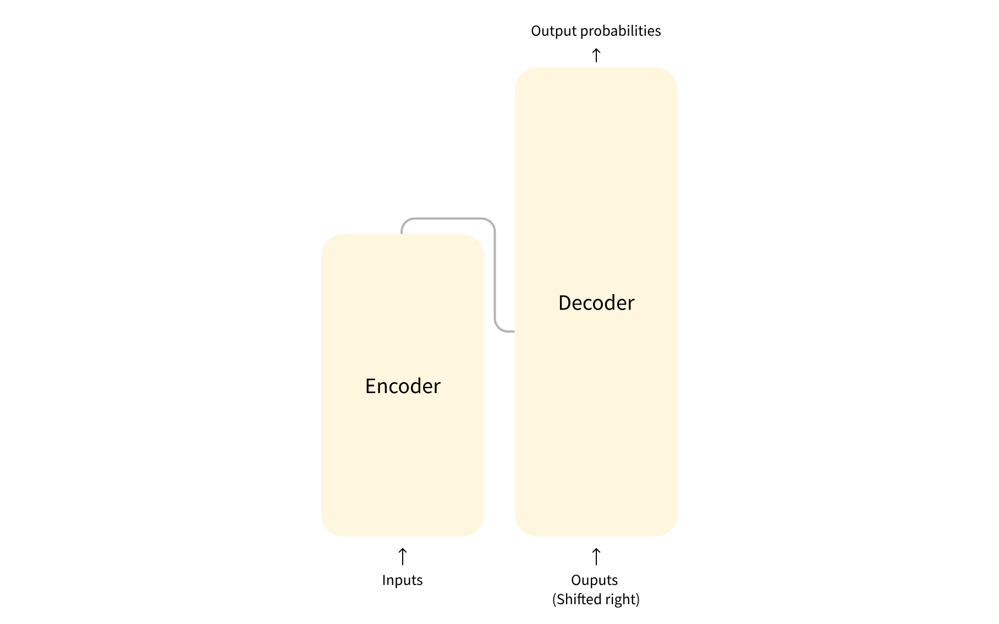
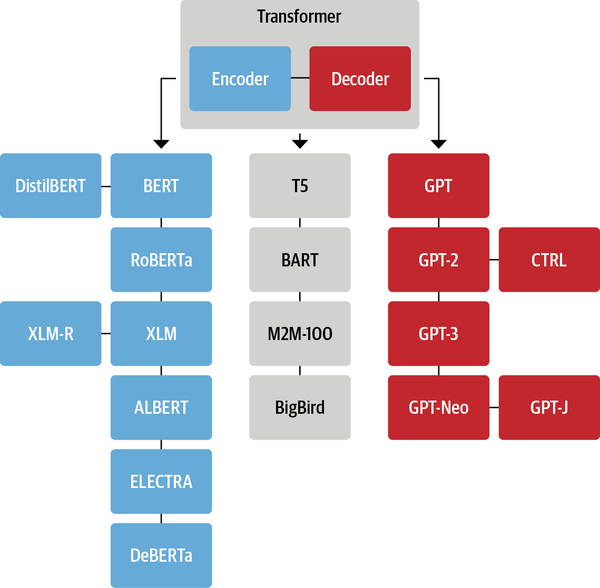

# 

大模型应用开发工程师

1. 工作内容：

* 负责大语言模型的应用研究和模型性能评估
* 负责大模型本地私有化部署和微调
* 负责 AI 智能体开发和多智能体协作产品研发
* 利用 SFT、RLHF、提示词工程等技术提高产品性能
* 协助产品经理确保 AI 智能体应用符合需求

2. 技能需求：

* Python 语言及其常用三方库
* 预训练模型（transformers）和提示词工程（Prompt Engineering）
* 智能体开发框架（LangChain、LlamaIndex、autogen等）
* 向量数据库（FAISS、Chroma等）和 RAG（检索增强生成）
* 其他相关工具（Dify、Haystack、MetaGPT等）


### 🍞 Transformer

#### 🎯 简介

Transformer 模型本质上都是预训练语言模型，大都采用自监督学习 (Self-supervised learning) 的方式在大量生语料上进行训练，也就是说，训练这些 Transformer 模型完全不需要人工标注数据。


**两个著名 Transformer 模型**

* GPT (the Generative Pretrained Transformer)；
* BERT (Bidirectional Encoder Representations from Transformers)。


**transformers库的主要功能包括：**

- 提供丰富的预训练模型，涵盖了目前主流的NLP任务，如文本分类、生成、摘要、问答等。
- 提供简洁的API接口，使得用户可以快速上手，无需关注模型的底层实现细节。
- 支持多种深度学习框架，如PyTorch和TensorFlow，方便用户根据自己的需求进行选择。
- 提供高效的性能，支持多GPU和分布式训练，满足大规模数据处理的需求。

**transformers库的主要优势包括：**

- 开源且持续更新，用户可以随时获取到最新的模型和功能。
- 社区活跃，有大量的教程和案例供用户参考，方便用户学习和交流。
- 模块化设计，用户可以根据需求灵活组合模型的各个部分，实现定制化的应用。


**Transformer 的结构**

标准的 Transformer 模型主要由两个模块构成：

* Encoder（左边）：负责理解输入文本，为每个输入构造对应的语义表示（语义特征）；
* Decoder（右边）：负责生成输出，使用 Encoder 输出的语义表示结合其他输入来生成目标序列。


**Transformer 家族**

虽然新的 Transformer 模型层出不穷，但是它们依然可以被归纳到以下三种结构中：




####  🎯Transformer 注意力机制

Transformer 模型之所以如此强大，是因为它抛弃了之前广泛采用的循环网络和卷积网络，而采用了一种特殊的结构——注意力机制 (Attention) 来建模文本。


#### 🎯 pipelines

Transformers 库将目前的 NLP 任务归纳为几下几类：

- **文本分类：**例如情感分析、句子对关系判断等；
- **对文本中的词语进行分类：**例如词性标注 (POS)、命名实体识别 (NER) 等；
- **文本生成：**例如填充预设的模板 (prompt)、预测文本中被遮掩掉 (masked) 的词语；
- **从文本中抽取答案：**例如根据给定的问题从一段文本中抽取出对应的答案；
- **根据输入文本生成新的句子：**例如文本翻译、自动摘要等。

Transformers 库最基础的对象就是 `pipeline()` 函数，它封装了预训练模型和对应的前处理和后处理环节。我们只需输入文本，就能得到预期的答案。目前常用的 [pipelines](https://huggingface.co/docs/transformers/main_classes/pipelines) 有：

- `feature-extraction` （获得文本的向量化表示）
- `fill-mask` （填充被遮盖的词、片段）
- `ner`（命名实体识别）
- `question-answering` （自动问答）
- `sentiment-analysis` （情感分析）
- `summarization` （自动摘要）
- `text-generation` （文本生成）
- `translation` （机器翻译）
- `zero-shot-classification` （零训练样本分类）


### 🍞 Pytorch

[Pytorch](https://pytorch.org/) 由 Facebook 人工智能研究院于 2017 年推出，具有强大的 GPU 加速张量计算功能，并且能够自动进行微分计算，从而可以使用基于梯度的方法对模型参数进行优化。截至 2022 年 8 月，PyTorch 已经和 Linux 内核、Kubernetes 等并列成为世界上增长最快的 5 个开源社区之一。现在在 NeurIPS、ICML 等等机器学习顶会中，有超过 80% 研究人员用的都是 PyTorch。

#### 🎯 Pytorch的优点

**1. 动态计算图**

PyTorch最突出的优点之一就是它使用了动态计算图（Dynamic Computation Graphs，DCGs），与TensorFlow和其他框架使用的静态计算图不同。动态计算图允许你在运行时更改图的行为。这使得PyTorch非常灵活，在处理不确定性或复杂性时具有优势，因此非常适合研究和原型设计。

**2. 易用性**

PyTorch被设计成易于理解和使用。其API设计的直观性使得学习和使用PyTorch成为一件非常愉快的事情。此外，由于PyTorch与Python的深度集成，它在Python程序员中非常流行。

**3. 易于调试**

由于PyTorch的动态性和Python性质，调试PyTorch程序变得相当直接。你可以使用Python的标准调试工具，如PDB或PyCharm，直接查看每个操作的结果和中间变量的状态。

**4. 强大的社区支持**

PyTorch的社区非常活跃和支持。官方论坛、GitHub、Stack Overflow等平台上有大量的PyTorch用户和开发者，你可以从中找到大量的资源和帮助。

**5. 广泛的预训练模型**

PyTorch提供了大量的预训练模型，包括但不限于ResNet，Inception，SqueezeNet 等等。这些预训练模型可以帮助你快速开始新的项目。

**6. 高效的GPU利用**

PyTorch可以非常高效地利用 NVIDIA 的 CUDA 库来进行GPU计算。同时，它还支持分布式计算，让你可以在多个GPU或服务器上训练模型。

#### 🎯 Pytorch的使用场景

**1. 计算机视觉**

在计算机视觉方面，PyTorch提供了许多预训练模型（如ResNet，VGG，Inception等）和工具（如TorchVision，可以用于图像分类、物体检测、语义分割和图像生成等任务。这些预训练模型和工具大大简化了开发计算机视觉应用的过程。

**2. 自然语言处理**

在自然语言处理（NLP）领域，PyTorch的动态计算图特性使得其非常适合处理变长输入，这对于许多NLP任务来说是非常重要的。同时，PyTorch也提供了一系列的NLP工具和预训练模型（如Transformer等），可以帮助我们处理文本分类、情感分析、命名实体识别、机器翻译和问答系统等任务。

**3. 生成对抗网络**

生成对抗网络（GANs）是一种强大的深度学习模型，被广泛应用于图像生成、图像到图像的转换、样式迁移和数据增强等任务。PyTorch的灵活性使得其非常适合开发和训练GAN模型。

**4. 强化学习**

强化学习是一种学习方法，其中智能体通过与环境的交互来学习如何执行任务。PyTorch的动态计算图和易于使用的API使得其在实现强化学习算法时表现出极高的效率。

**5. 时序数据分析**

在处理时序数据的任务中，如语音识别、时间序列预测等，PyTorch的动态计算图为处理可变长度的序列数据提供了便利。同时，PyTorch提供了包括RNN、LSTM、GRU在内的各种循环神经网络模型。


#### 🎯 张量

张量 (Tensor) 是深度学习的基础，例如常见的 0 维张量称为标量 (scalar)、1 维张量称为向量 (vector)、2 维张量称为矩阵 (matrix)。Pytorch 本质上就是一个基于张量的数学计算工具包，它提供了多种方式来创建张量：


```python
>>> import torch
>>> torch.empty(2, 3) # empty tensor (uninitialized), shape (2,3)
tensor([[2.7508e+23, 4.3546e+27, 7.5571e+31],
        [2.0283e-19, 3.0981e+32, 1.8496e+20]])
>>> torch.rand(2, 3) # random tensor, each value taken from [0,1)
tensor([[0.8892, 0.2503, 0.2827],
        [0.9474, 0.5373, 0.4672]])
>>> torch.randn(2, 3) # random tensor, each value taken from standard normal distribution
tensor([[-0.4541, -1.1986,  0.1952],
        [ 0.9518,  1.3268, -0.4778]])
>>> torch.zeros(2, 3, dtype=torch.long) # long integer zero tensor
tensor([[0, 0, 0],
        [0, 0, 0]])
>>> torch.zeros(2, 3, dtype=torch.double) # double float zero tensor
tensor([[0., 0., 0.],
        [0., 0., 0.]], dtype=torch.float64)
>>> torch.arange(10)
tensor([0, 1, 2, 3, 4, 5, 6, 7, 8, 9])
```


