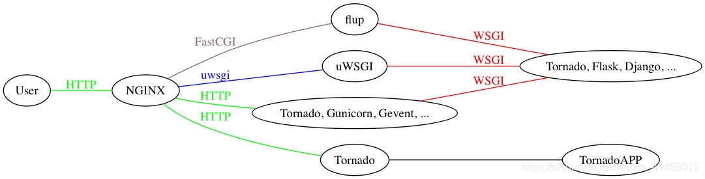
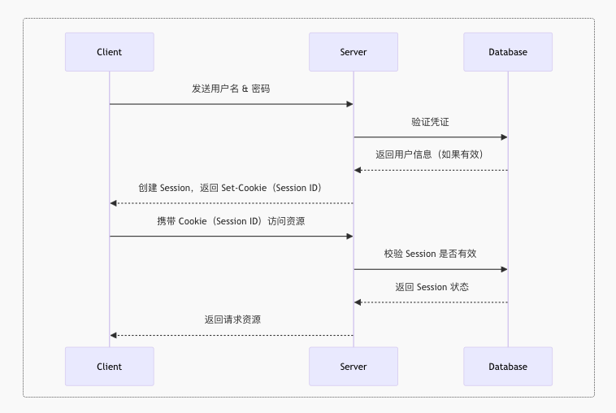
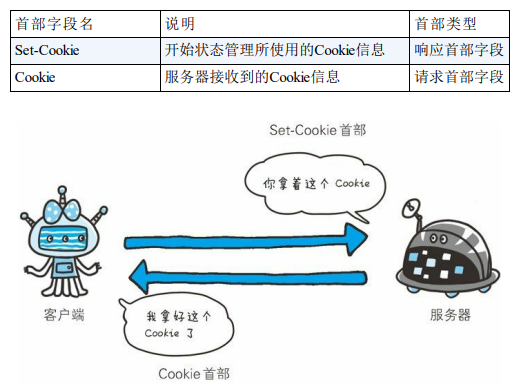
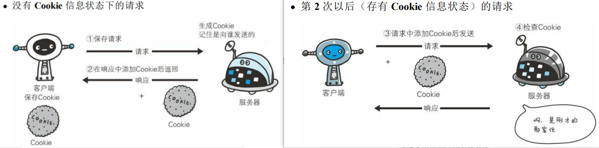
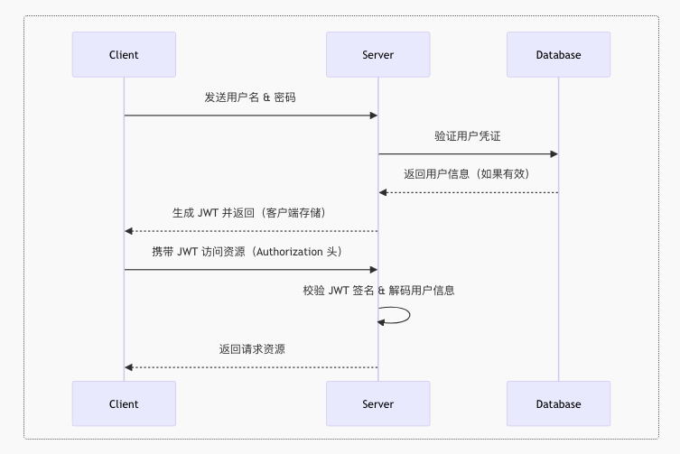

# 

### 🍞 HTTP

在Web应用中，服务器把网页传给浏览器，实际上就是把网页的HTML代码发送给浏览器，让浏览器显示出来。而浏览器和服务器之间的传输协议是HTTP，所以：

- HTML是一种用来定义网页的文本，会HTML，就可以编写网页；
- HTTP是在网络上传输HTML的协议，用于浏览器和服务器的通信。

#### 🎯 HTML
网页就是HTML？这么理解大概没错。因为网页中不但包含文字，还有图片、视频、HTML5小游戏，有复杂的排版、动画效果，所以，HTML定义了一套语法规则，来告诉浏览器如何把一个丰富多彩的页面显示出来。

```html
<html>
<head>
  <title>Hello</title>
</head>
<body>
  <h1>Hello, world!</h1>
</body>
</html>
```

#### 🎯 CSS简介

CSS是Cascading Style Sheets（层叠样式表）的简称，CSS用来控制HTML里的所有元素如何展现，比如，给标题元素`<h1>`加一个样式，变成48号字体，灰色，带阴影：

```html
<html>
<head>
  <title>Hello</title>
  <style>
    h1 {
      color: #333333;
      font-size: 48px;
      text-shadow: 3px 3px 3px #666666;
    }
  </style>
</head>
<body>
  <h1>Hello, world!</h1>
</body>
</html>
```

#### 🎯 JavaScript简介

JavaScript虽然名称有个Java，但它和Java真的一点关系没有。JavaScript是为了让HTML具有交互性而作为脚本语言添加的，JavaScript既可以内嵌到HTML中，也可以从外部链接到HTML中。如果我们希望当用户点击标题时把标题变成红色，就必须通过JavaScript来实现：

```html
<html>
<head>
  <title>Hello</title>
  <style>
    h1 {
      color: #333333;
      font-size: 48px;
      text-shadow: 3px 3px 3px #666666;
    }
  </style>
  <script>
    function change() {
      document.getElementsByTagName('h1')[0].style.color = '#ff0000';
    }
  </script>
</head>
<body>
  <h1 onclick="change()">Hello, world!</h1>
</body>
</html>
```

### 🍞 CGI
CGI（Common Gateway Interface）通用网关接口，是一个协议，是外部应用程序（CGI 程序）与 Web 服务器之间的接口标准，该协议定义了 Web 服务器调用外部应用程序的时候需要输入的参数，和给 Web 服务器的返回结果。

通俗来说，它规定一个程序该如何与 Web 服务器程序之间通信，从而可以让这个程序跑在 Web 服务器上。

**每当客户请求 CGI 的时候，WEB服务器就请求操作系统生成一个新的CGI解释器进程（如 php-cgi.exe），CGI 的一个进程则处理完一个请求后退出，下一个请求来时再创建新进程。当然，这样在访问量很少没有并发的情况也行。但当访问量增大，并发存在，这种方式就不适合了，于是就有了FastCGI**


### 🍞 FastCGI
FASTCGI 是 Web 服务器（ex:Nginx）和语言解释器（ex:uWsgi）两者底层的通信协议的规范，是对CGI的开放的扩展。

CGI的一个扩展，像是一个常驻（long-live）型的CGI ，废除了 CGI fork-and-execute （来一个请求 fork 一个新进程处理，处理完再把进程 kill 掉）的工作方式，转而使用一种长生存期的方法，减少了进程消耗，提升了性能。

而FastCGI 则会先 fork 一个 master 进程，解析配置文件，初始化执行环境，然后再 fork 多个 worker 进程（与 Nginx 有点像），当 HTTP 请求过来时，master 进程将其会传递给一个 worker 进程，然后立即可以接受下一个请求，这样就避免了重复的初始化操作，效率自然也就提高了。

而且当 worker 进程不够用时，master 进程还可以根据配置预先启动几个 worker 进程等着；当空闲 worker 进程太多时，也会关掉一些，这样不仅提高了性能，还节约了系统资源

### 🍞 WSGI

WSGI，（WEB SERVER GATEWAY INTERFACE），Web服务器网关接口，是一种Web服务器网关接口，它是一个Web服务器（如Nginx，uWSGI等服务器）与Web应用（如Flask框架写的程序）通信的一种规范。当前运行在WSGI协议之上的Web框架有Bottle，Flask，Django。

### 🍞 uwsgi
同WSGI一样是一种通信协议

uwsgi协议是一个uWSGI服务器自有的协议，它用于定义传输信息的类型（type of information），每一个uwsgi packet前4byte为传输信息类型描述，它与WSGI相比是两样东西。

### 🍞 uWSGI
它是一个Web服务器，它实现了WSGI协议、uwsgi、http等协议。用于接收前端服务器转发的动态请求并处理后发给 Web 应用程序。

uWSGI是使用C编写的，显示了自有的uwsgi协议的Web服务器。它自带丰富的组件，其中核心组件包含进程管理、监控、IPC等功能，实现应用服务器接口的请求插件支持多种语言和平台，比如WSGI、Rack、Lua WSAPI，网管组件实现了负载均衡、代理和理由功能。

uWSGI也可以当做中间件。

- 如果是Nginx+uWSGI+App，那uWSGI就是一个中间件
- 如果是uWSGI+App，那它就是服务器



假设我们使用 Python 的 Django 框架写了一个网站，现在要将它挂在网上运行，我们一般需要：

- Nginx 做为代理服务器：负责静态资源发送（js、css、图片等）、动态请求转发以及结果的回复。
- uWSGI 做为后端服务器：负责接收 Nginx 转发的请求并处理后发给 Django 应用以及接收 Django 应用返回信息转发给 Nginx。
- Django 应用收到请求后处理数据并渲染相应的返回页面给 uWSGI 服务器。


一个Django应用，通过WSGI协议连接uWSGI服务器，uWSGI服务器实现WSGI、http等协议，通过uwsgi协议和Nginx服务器实现http的动态请求和转发以及结果。


下面是一个简单的WSGI应用程序示例：

```python
def application(environ, start_response):
    status = '200 OK'
    response_headers = [('Content-type', 'text/plain')]
    start_response(status, response_headers)
    return [b'Hello, World!']
```

使用 uwsgi 启动该应用：
```shell
uwsgi --http :8080 --wsgi-file codes/03_python/p_05.py
```

### 🍞 Nginx
一个普通的个人网站，访问量不大的话，当然可以由 uWSGI 和 Django 构成。但是一旦访问量过大，客户端请求连接就要进行长时间的等待。这个时候就出来了分布式服务器，我们可以多来几台 Web 服务器，都能处理请求。

但是谁来分配客户端的请求连接和 Web 服务器呢？Nginx 就是这样一个管家的存在，由它来分配。这也就是由 Nginx 实现反向代理，即代理服务器。


Nginx 是一个 HTTP 和反向代理服务器

- 正向代理：正向的就是由浏览器主动的想代理服务器发出请求，经代理服务器做出处理后再转给目标服务器
- 反向代理：反向的就是不管浏览器同不同意，请求都会经过代理服务器处理再发给目标服务器

使用Nginx作为反向代理服务器的好处：

- 安全

不管什么请求都要经过代理服务器，可以避免外部程序直接攻击Web服务器

- 负载均衡

根据请求情况和服务器负载情况，将请求分配给不同的Web服务器，保证服务器性能

- 提高Web服务器的IO性能

请求从客户端传到Web服务器是需要时间的，传递多长时间就会让这个进程阻塞多长时间，而通过反向代理，就可以由反向代理完整接受该请求，然后再传给Web服务器，从而保证服务器性能，而且有的一些简单的事情（比如静态文件）可以直接由反向代理处理，不经过Web服务器。

### 🍞 ASGI
异步网关协议接口，一个介于网络协议服务和Python应用之间的标准接口，能够处理多种通用的协议类型，包括HTTP，HTTP2和WebSocket。

然而目前的常用的WSGI主要是针对HTTP风格的请求响应模型做的设计，并且越来越多的不遵循这种模式的协议逐渐成为Web变成的标准之一，例如WebSocket。

ASGI尝试保持在一个简单的应用接口的前提下，提供允许数据能够在任意的时候、被任意应用进程发送和接受的抽象。并且同样描述了一个新的，兼容HTTP请求响应以及WebSocket数据帧的序列格式。允许这些协议能通过网络或本地socket进行传输，以及让不同的协议被分配到不同的进程中。

**WSGI和ASGI的区别**
WSGI是基于HTTP协议模式的，不支持WebSocket，而ASGI的诞生则是为了解决Python常用的WSGI不支持当前Web开发中的一些新的协议标准。同时，ASGI对于WSGI原有的模式的支持和WebSocket的扩展，即ASGI是WSGI的扩展。

### 🍞 Web 服务器和 Web框架

Web服务器即用来接受客户端请求，建立连接，转发响应的程序。至于转发的内容是什么，交由Web框架来处理，即处理这些业务逻辑。如查询数据库、生成实时信息等。Nginx就是一个Web服务器，Django或flask就是Web框架。

那么如何实现uWSGI和WSGI的配合呢？如何做到任意一个Web服务器，都能搭配任意一个框架呢？这就产生了WSGI协议。只要Web服务器和Web框架满足WSGI协议，它们就能相互搭配。所以WSGI只是一个协议，一个约定。而不是Python的模块、框架等具体的功能。

而uWSGI，则是实现了WSGI协议的一个Web服务器。即用来接受客户端请求，转发响应的程序。实际上，一个uWSGI的Web服务器，再加上Django这样的Web框架，就已经可以实现网站的功能了。


### 🍞 uvicorn 库

Python Uvicorn 是一个快速的 ASGI（Asynchronous Server Gateway Interface）服务器，用于构建异步 Web 服务。它基于 asyncio 库，支持高性能的异步请求处理，适用于各种类型的 Web 应用程序。本文将介绍 Uvicorn 的基本概念、使用方法以及一些实际示例，帮助快速上手构建异步 Web 服务。

Uvicorn 是由 Starlette 框架的作者编写的 ASGI 服务器，旨在提供高性能的异步请求处理能力。它使用 asyncio 库实现异步 I/O 操作，支持 HTTP 和 WebSocket 协议，可与各种 ASGI 应用程序框架（如 FastAPI、Django、Starlette 等）配合使用。

### 🍞 Web身份验证的两种方式

我们开发了一个 Web 应用，比如开发了几个 Flask API，我们不想让所有人都能调用这些接口。在这种情况下，我们一般会让用户填写**用户名+密码**，身份认证成功之后，才允许用户访问 API。但是不能用户每次调用接口都需要输入用户名和密码，一方面这么做太麻烦了，另一方面每一次请求都明文附带用户名和密码也会造成安全隐患。为此，我们需要采用某种**身份认证机制**，允许用户**在输入一次用户名+密码后保持身份**，并且使用安全的方式在多次请求之中保留这种身份验证信息。

但这种在 Web 中的状态保持并不是自然的，我们在 Web 中发送或者接收消息，采用的都是 HTTP（HyperText Transfer Protocol，超文本传输协议）。**HTTP 定义了 Web 服务器和客户端之间通信的规则**，可以把它看成是一种信件格式约定。HTTP 协议规定了我们发送的 HTTP 请求以及服务器返回的 HTTP 响应的格式，比如请求由请求行（Request Line）、请求头（Headers）、请求体（Body）三部分组成，响应由状态行（Status Line）、响应头（Headers）、响应体（Body）三部分组成。**HTTP 协议是一种无状态（Stateless）协议**，每个请求-响应都会被视为独立的一次会话。无状态也就意味着服务器不会记住之前的请求信息，假如我们想要在多次请求中保留用户的身份验证信息，就必须设计某种方案来帮助服务器识别用户。在无状态的协议中想保持状态，肯定需要在请求报文中附加额外的参数来去标志某个记忆，否则信息就不守恒了。

根据附加参数相关的机制不同，目前有两种主要的身份认证的保持方式：基于 **Session（会话）**的认证和基于 **Token（令牌）** 的认证。

#### 🎯  **Session（会话）**

Session 是服务器端用于跟踪和存储用户状态的一种机制。在服务器启用了 session 机制时，用户登录后服务器会创建一个 session 对象并且返回给用户这个 session 的 ID，session 对象储存了用户的信息。用户需要在后续的 HTTP 请求中携带 session ID，服务器根据 session ID 查找对应的 session 来识别用户。服务器可以在 session 中存储**用户ID、角色、或者之前交互的信息（比如购物车）**等等数据。

下图展示了 session 的典型工作流程：

**1. 用户登录**：

- 用户提交 **用户名和密码**。
- 服务器验证凭据，并**在服务器端创建 Session**，存储用户身份信息（如 `user_id`）。
- 服务器生成一个唯一的 **Session ID** 并存入 **Cookie**，发送给客户端。

**2. 用户访问受保护资源**：

- 客户端在请求时**自动携带 Cookie（Session ID）**。
- 服务器收到请求后，**通过 Session ID 查询会话信息**，确认用户身份。

**3. 用户登出或 Session 过期**：

- 服务器可以手动**删除 Session**，或设定 Session 过期时间（如 30 分钟）。

- 过期后，用户需要重新登录。

  

**Cookie**

> 上野宣. 图解 HTTP[M]. 人民邮电出版社, 2014.



这里涉及到了 Cookie 技术，Cookie 就是服务器在响应报文中增加一个叫作 `Set-Cookie` 的首部字段信息。用户的客户端收到了响应报文后，会按照 `Set-Cookie` 的指令保存 Cookie 值。当下次客户端再次往服务器发送请求的时候，就会自动在请求报文中加入 Cookie 值。服务器端发现客户端发送过来的 Cookie 后，会去根据 Cookie 值查询服务器上的记录，就像根据字典的键查到字典的值一样，得到之前的状态信息。



HTTP 请求报文和响应报文的内容如下：

1. 请求报文（没有 Cookie 信息的状态）

   ```html
   GET /reader/ HTTP/1.1
   Host: hackr.jp
   * 首部字段里没有Cookie的相关信息
   ```

2. 响应报文（服务器端生成 Cookie 信息）

   ```html
   HTTP/1.1 200 OK
   Date: Thu, 12 Jul 2012 07:12:20 GMT
   Server: Apache
   ＜Set-Cookie: sid=1342077140226724; path=/; expires=Wed,
   10-Oct-12 07:12:20 GMT＞
   Content-Type: text/plain; charset=UTF-8
   ```

   这里的 sid 就是 session ID。

3. 请求报文（自动发送保存着的 Cookie 信息）

   ```html
   GET /image/ HTTP/1.1
   Host: hackr.jp
   Cookie: sid=1342077140226724
   ```

浏览器会自动识别 `Set-Cookie` 指令，自动地存储和发送 Cookie。而如果我们是通过 `curl` 或者 `requests` 库等进行 API 调用，我们需要手动添加 Cookie。比如在 curl 里，我们可以用 `-v` 参数显示响应的详细内容，之后再通过 `-b` 参数为请求添加 Cookie：

```shell
curl -X GET http://127.0.0.1:5000/protected -b "session=abcd1234xyz"
```

**Flask 实现**

```python
from flask import Flask, request, jsonify, session
from flask_session import Session

app = Flask(__name__)

# 配置 Session 存储方式
app.config['SECRET_KEY'] = 'your_secret_key'  # 用于加密 Session 数据
app.config['SESSION_TYPE'] = 'filesystem'  # Session 存储在服务器文件系统
Session(app)

# 模拟数据库存储用户
users = {"admin": "password123"}

# 登录接口
@app.route('/login', methods=['POST'])
def login():
    data = request.json
    username = data.get("username")
    password = data.get("password")

    if users.get(username) == password:
        session["user"] = username  # 在 Session 中存储用户信息
        return jsonify({"message": "Login successful"}), 200
    return jsonify({"message": "Invalid credentials"}), 401

# 受保护接口（需要登录）
@app.route('/protected', methods=['GET'])
def protected():
    if "user" not in session:
        return jsonify({"message": "Unauthorized"}), 401
    return jsonify({"message": f"Hello, {session['user']}! You are authenticated."})

# 退出登录（删除 Session）
@app.route('/logout', methods=['POST'])
def logout():
    session.pop("user", None)  # 删除用户 Session
    return jsonify({"message": "Logged out"}), 200

if __name__ == '__main__':
    app.run(debug=True)
```

在 Flask 中使用 session 功能，需要安装 `flask-session` 扩展。在这里，`app.config` 是 Flask 的全局配置对象，所有的 Flask 组件（比如 `flask-session` 、`flasgger` 、`JTWManager`等）都可以从 `app.config` 中读取相关的配置。在 Flask 中，所有的 session 数据都会被加密，`SECRET_KEY` 是 session 的加密密钥，类似于随机数的种子，根据 `SECRET_KEY` 的值的不同加密出来的 session 数据也不同。


`SESSION_TYPE` 是指 session 数据的存储方式。在默认情况下，flask-session 不会在服务器端存储用户的 session 数据，而是直接把用户的 session 数据用 `SECRET_KEY` 进行加密和签名，将 session 数据直接储存到 Cookie 值中，返回给客户端。客户端之后的每次请求都附带这个 Cookie 值，服务器端再用 `SECRET_KEY` 将 Cookie 值进行解码和验证，读取 session 数据。这样做有一些问题，第一就是 Cookie 中直接包含了所有的 session 数据，一旦服务器端的 `SECRET_KEY` 被盗取，那么 session 数据就会泄露。其次 Cookie 的大小通常限制在 4KB，无法存储太大量的数据。我们可以把 session 数据直接存储到服务器端，服务器把 session 数据存储在数据库或者文件中，并生成一个唯一的 `session_id`。这样服务器只需要把 `session_id` 存储在 Cookie 里，Cookie 本身可以不包含任何用户数据。客户端之后的请求只需要附带 `session_id`，服务器拿到 `session_id` 就可以在数据库或者文件中查找用户数据了。这样的方式更安全，即使 `session_id` 泄露，攻击者也无法获取具体的 session 数据，此外也可以存储更加大量的数据。在 flask-session 中，`SESSION_TYPE` 可以选择 `null`（Cookie）、`filesystem`（文件系统）、`redis`（Redis存储）、`memcached`（Memcached存储）、`mongodb`（MongoDB存储）、`sqlalchemy`（数据库存储）几种。当选取 `filesystem` 时，如果不配置 `SESSION_FILE_DIR` ，Flask 会默认存储到主程序文件同目录的 `flask_session` 目录下面。


在这个简单的例子里，当访问 `/login` 接口登录验证成功后，服务器会创建 `session["user"]`，在服务器端存储 session 数据，这里存储的数据就是 `user` 字段的值。服务器会返回 `Set-Cookie`，存储 session ID 到客户端。后续的请求只有附带 Cookie 后才能访问 `/protected` 接口。 这里需要注意的是只要 Flask 发现 session 数据又变化，就会返回 `Set-Cookie` 响应头，更新 session ID。不论是第一次写入 `session["user"] = "admin"` 还是存入新的键值对时 `session["user_id"] = 42` 或者修改数据时 `session.pop("user", None)`。另外，在不同用户访问 API 时，他们的 `session` 是独立的，每个用户的 `session` 存储的数据是不同的。每个用户都有自己的 `Session ID`，服务器会根据 session ID 识别不同的用户，并存储与之对应的数据。


这里的例子只是为了介绍 session 的使用，直接存储了明文的密码。在实际应用中服务器不应该直接存储明文密码，否则一旦数据库被破解那么所有的用户密码就都泄露了。一般情况下，服务器会存储哈希（Hash）后的用户密码。当用户登陆时，服务器会哈希（Hash）用户输入的明文密码，然后与存储的哈希密码进行比对。如果匹配，则认证成功。哈希是一种将任意长度的输入数据转换为固定长度输出（哈希值）的算法。哈希函数是不可逆的，无法从哈希值还原原始数据。在 Python 中，我们可以使用 `bcrypt` 库进行密码的存储和验证。此时

```python
# 模拟数据库（已存储 bcrypt 加密的密码）
users = {
    "admin": bcrypt.hashpw("password123".encode('utf-8'), bcrypt.gensalt()),  # 预存一个管理员账号
}

# 用户登录（验证 bcrypt 密码）
@app.route('/login', methods=['POST'])
def login():
    data = request.json
    username = data.get("username")
    password = data.get("password")

    stored_hashed_password = users.get(username)  # 取出存储的哈希密码
    if not stored_hashed_password:
        return jsonify({"message": "Invalid username"}), 401

    # 使用 bcrypt 校验用户输入的密码是否匹配存储的哈希密码
    if not bcrypt.checkpw(password.encode('utf-8'), stored_hashed_password):
        return jsonify({"message": "Invalid password"}), 401

    # 登录成功，存入 Session
    session["user"] = username
    return jsonify({"message": "Login successful"}), 200
```

这里还是简单地将明文密码放到了程序中。在实际应用中，系统可以预先定义一个默认密码，例如 `"admin123"` 或 `"password"`，然后在首次登录后要求用户修改密码。或者可以在每次运行时，都生成一个新的初始密码，仅将密码输出到控制台中。也可以通过环境变量作为种子配置初始的超级用户密码。或者要求用户在首次启动时手动设置超级用户密码。其他的用户，在运行时通过注册接口注册后，保存哈希密码即可。


#### 🎯   **Token（令牌）**

在上一部分介绍了 Session 作为 Web 身份认证的传统方式。Session 通过在服务器端存储用户状态，并在客户端以 Cookie 方式存储会话 ID 来维持登录状态。随着前后端分离架构的流行，基于 **Token** 的身份认证方式逐渐成为主流。其中，**JWT（JSON Web Token）** 作为一种轻量级的无状态认证方案，被广泛应用于 RESTful API 认证。JWT 的流程其实和 session 很像：

1. 用户使用**用户名和密码**登录。
2. 服务器验证用户信息正确后，**生成 JWT**，并返回给客户端。
3. 客户端在后续请求时，**携带 JWT**（通常放在 HTTP 头 `Authorization: Bearer <JWT>`）。
4. 服务器收到请求后，**验证 JWT**，如果有效，则允许访问，否则拒绝。

JWT 和 session 的流程是很类似的，session 的方式是客户端把 session ID 放在 Cookie 里，然后服务器验证 Session ID。JWT 的方式就是客户端把 JWT 放在请求里，然后服务器验证 JWT。JWT 由 **Header（头部）、Payload（负载）、Signature（签名）** 三部分组成。服务器生成 JWT 时，它会将 **Header**、**Payload** 和 **Signature** 连接起来，形成一个字符串 Token：

> Header.Payload.Signature

其中 Header、Payload 经过 Base64Url 编码，Signature 由服务器的私钥签名，用于验证 Token 的合法性，和在 session 中的 `SECRET_KEY` 的作用是一致的。经编码后，JWT 的 Token 就可能长成这样：


> eyJhbGciOiJIUzI1NiIsInR5cCI6IkpXVCJ9
>
> 
>
> eyJzdWIiOiIxMjM0NTY3ODkwIiwibmFtZSI6IkpvaG4gRG9lIiwiaWF0IjoxNTE2MjM5MDIyfQ
>
> 
>
> SflKxwRJSMeKKF2QT4fwpMeJf36POk6yJV_adQssw5c


客户端后续请求时把这个 Token 附带在 HTTP 头中，就可以完成验证了。



**JWT 和 session 的核心区别是服务器是否储存会话数据**。在 session 的方案中，服务器在验证用户信息之后，会在服务器端创建一个 session，并生成一个唯一的 session ID。后续依据请求的 session ID 在 session 中查找信息，完成验证。而 JWT 则是直接生成一个签名加密后的 Token 返回给客户端，服务器不存储 JWT。后续服务器直接解析客户端请求中的 Token，无需查询数据库即可完成身份验证。**在 JWT 中每次请求都是独立的，适合分布式架构**。JWT 实际上类似于 flask-session 中的 `SESSION_TYPE = 'null'` 模式，将所有 session 数据都存储在客户端 Cookie 里，而不是服务器端。但是相比于 `SESSION_TYPE = 'null'`，JWT 的存储不局限于在 Cookie 中，也因此克服了 Cookie 在跨域认证等方面的限制，更加适合于前后端分离的应用场景。


**Flask 实现**

```python
from flask import Flask, jsonify, request
from flask_jwt_extended import JWTManager, create_access_token, get_jwt_identity, verify_jwt_in_request

app = Flask(__name__)

# 设置 JWT 密钥
app.config['JWT_SECRET_KEY'] = 'super-secret-key'  # 使用更安全的密钥
jwt = JWTManager(app)

# 模拟用户数据库
users = {
    "admin": {"password": "123456", "username": "admin"},
}

# 登录接口
@app.route('/login', methods=['POST'])
def login():
    data = request.get_json()
    username = data.get("username")
    password = data.get("password")

    user = users.get(username)
    if user and user["password"] == password:
        # 生成 JWT Token
        access_token = create_access_token(identity=username)
        return jsonify(access_token=access_token)
    
    return jsonify({"msg": "用户名或密码错误"}), 401

# 受保护的 API
@app.route('/protected', methods=['GET'])
def protected():
    current_user = get_jwt_identity()  # 由于 before_request 里已验证 JWT，这里可以直接获取
    return jsonify(logged_in_as=current_user), 200

# 统一检查请求是否有 JWT（除了 /login）
@app.before_request
def check_jwt():
    if request.path != "/login":  # 只允许 /login 不需要 JWT
        try:
            verify_jwt_in_request()  # 直接验证 JWT
        except Exception as e:
            return jsonify({"msg": f"Token 错误: {str(e)}"}), 401

if __name__ == '__main__':
    app.run(debug=True)
```

在 Flask 中使用 JWT，需要安装 `flask_jwt_extended` 扩展。和 flask-session 一样，首先在 `app.config` 里，需要设置 `JWT_SECRET_KEY` 密钥，用于对 JWT 进行签名和验证。在 `/login` 端点中，用户提交用户名和密码，服务器在验证用户及密码后，调用 `create_access_token()` 生成 JWT，返回给客户端。这里的 `identity` 是指定生成的 Token 的用户信息，在其他端点调用 `get_jwt_identity()` 就可以提取出用户请求中 Token 里的 `identity` 字段，它会自动解析 HTTP 请求并解析 JWT。Flask 的 `jsonify()` 会自动地将关键字参数转换为 JSON，同时设置 JSON 格式的 HTTP 头部。如果不传递关键字参数而是直接传递字典，那么 `jsonify()` 就会直接把字典转换成 JSON。`@app.before_request` 装饰器下面的函数在每个请求处理前都会执行。在这里，`check_jwt` 函数可以进行统一的 JWT 检查，除了 `/login`，所有的路由都必须验证 JWT。flask_jwt_extended 提供了 `verify_jwt_in_request()` 函数，它可以直接检查 JWT 的有效性。


区别一览：																				

| 特性         | **Session**                                      | **Token (JWT)**                             |
| ------------ | ------------------------------------------------ | ------------------------------------------- |
| **存储位置** | 服务器端存储会话信息                             | 客户端存储（cookie / localStorage）         |
| **无状态**   | 否，服务器需要存储会话信息                       | 是，无状态，身份信息在 token 中自包含       |
| **扩展性**   | 难，依赖共享存储，分布式系统较难扩展             | 易，适合微服务和分布式架构                  |
| **性能**     | 高并发时会对服务器造成压力                       | 不需要在服务器端存储用户信息，减轻负担      |
| **安全性**   | 高，信息保存在服务器端，只有 session ID 在客户端 | 中等，Token 存储在客户端，易受 XSS 攻击影响 |
| **适用场景** | 小型应用、单机服务器、需要严格安全控制的场景     | 分布式系统、微服务、移动端应用、前后端分离  |
| **会话管理** | 易于管理，会话过期、登出控制简单                 | 需要手动处理 token 过期和吊销               |