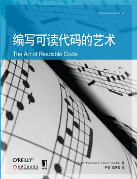

# 1.代码应当易于理解
代码的写法应当使别人理解它所需的时间最小化。（相比于仅仅减少行数来说）如果与其他理念冲突，本条优先。

# 2.把信息装进名字里

- 选择专业的词语(清晰和精确)。比如 fetchPage 优于 getPage
- 避免宽泛的名字: 避免 tmp 和 retval 这样宽泛的名字。好的名字应当描述变量的目的或者它承载的值，tmp_file 也比 tmp 好
- 用具体的名字代替抽象的名字
- 使用前缀或者后缀给名字附带更多信息(英语表示法，非匈牙利命名法)。比如 delay_secs, html_utf8
- 决定名字的长度：小的作用域尽可能用短名称，否则应该包含足够的信息。缩略词（团队新成员能否理解它的含义，不能就不要用偏门的缩写）
- 利用名字的格式表达含义：比如纯大写表示常量等，骆驼命名法表示类等，遵循一门语言的编程命名约定。在项目中保持一致的命名法

# 3.不会误解的名字
不要使用有歧义的名称

- 用 max_ 和 min_ 前缀表示上限和下限；对于包含的范围用 first 和 last；对于包含/排除范围（左闭右开区间）用 begin 和 end
- is、has、can、或 should 这样的词能使得 bool 值更明确，并且尽量避免用反义词汇。比如 use_ssl 好于 disable_ssl。（人脑更易于理解正向词汇）
- 与使用者的期望匹配：比如使用 get 误让使用者以为这是轻量级操作，可以用 compute 替代

# 4. 审美
好的代码应该看上去『养眼』，三条原则：

- 使用一致的布局，让读者很快就能习惯这种风格
- 让相似的代码看上去相似
- 把相关的代码分组，形成代码块

编程的大部分时间都花在看代码上，浏览代码的速度越快，越容易使用它：

- 重新安排换行来保持一致和紧凑
- 提炼出『方法』整理不规则的东西
- 在需要的时候使用『列对齐』。（有些编辑器插件能帮助你做这种事，比如 http://vimcasts.org/episodes/aligning-text-with-tabular-vim/）
- 选择一个有意义的顺序。比如字典序、重要性等排序
- 把声明按照块组织起来，按照逻辑分组
- 把代码分成段落，比如按照步骤来分段
- 一致的风格比正确的风格重要

# 5. 该写什么样的注释
好代码>差代码+好注释
什么时候加上：别人看不懂；代码使用的注意事项；

- 什么不需要注释。不要拐杖式注释，试图粉饰可读性差的代码的注释。
- 用代码记录你的思想。加入『指导性批注』；为瑕疵写注释(TODO,FIXME,HACK)；给常量加注释；
- 站在读者的角度，去想象他们需要知道什么。
  - 别人读你代码在想为什么要这样的地方需要注释；
  - 可能的陷阱。比如代码中数据上规模以后有严重性能问题等
  - 全局观注释。类之间如何交互，数据流动，入口点在哪里等。
  - 总结性注释。帮助快速理解代码块，不用迷失在细节中

# 6. 写出言简意赅的注释
注释应当具有很高的高信息/空间率

- 让注释保持紧凑
- 避免使用不明确的代词，用代码名称代替 it 等词语
- 润色粗糙的句子
- 精确描述函数的行为
- 用输入输出例子来描述特殊的情况（更直观）
- 声明代码的意图。很多时候注释就是告诉读者你写代码的时候怎么想的。
- 使用具名函数。python 等语言能这么调用 f(timeout=1)
- 采用信息量高的词语。业界常用词汇

# 7. 把控制流变得易读

- 条件语句中参数的顺序。条件表达式左边的值倾向于是变化的值，右边的值倾向于常量
- if/else 语句块的顺序。建议：先处理正常逻辑；先处理简单的情况；先处理有趣或者可疑的情况
- 三目运算符。 相对于减少代码行数，更好的度量方法是理解它的时间。不太建议在三目运算符中使用复杂的表达式，不如 if/else 直观
- 避免使用 do/while
- 从函数中提前返回
- 最小化嵌套。过多的逻辑嵌套会导致难以理解，大脑不断"入栈出栈"，增大圈复杂度
- 通过提前返回减少嵌套
- 你能理解程序执行的流程吗？线程、信号量（中断）、异常、匿名函数、虚方法等会让流程难以理解，不要滥用。

# 8. 拆分超长表达式
大多数人的大脑最多只能同时考虑 3~4 件事情，代码中的表达式越长，就越难理解。

- 引入解释变量。
  - `if line.split(':')[0].strip() == "root"` 改为如下表达式:
  - `username = line.split(':')[0].strip(); if username == "root"`
- 总结变量。`boolean user_owns_document = (request.user.id == document.owner_id)`
- 使用德摩根律简化逻辑表达式。（口诀：分别取反，转换与/或）
  - not (a or b or c) <=> (not a) and (not b) and (not c)
  - not (a and b and c) <=> (not a) or (not b) or (not c)
- 不要滥用短路逻辑。短路求值有时候会很简洁，但是影响可读性
- 从逻辑的反面思考有时候能简化表达式
- 提炼重复表达式为变量

# 9. 变量与可读性
变量的草率运用会让程序更难理解：

- 变量越多，越难以跟踪他们的动向
- 变量的作用域越大，就需要跟踪它的动向越久
- 变量改变地越频繁，就越难以跟踪它的当前值

增强可读性的方式：

- 减少不必要临时变量；比如它没有拆分任何复杂的表达式；没有做出更多澄清；只使用过一次等
- 减少中间结果
- 减少控制流变量：比如 done 标记。可以通过运用结构化编程消除
- 缩小变量作用域：防止名称污染。让你的变量对尽量少的代码可见，减少读者同时需要思考的变量个数。
- 把变量定义放到使用前
- 只写一次的变量更好。常量往往不会引来麻烦。让变量在较少的地方有改动，操作它的地方越多，越难以确定它的值

# 10. 抽取不相关子问题
积极抽出不相关子问题，能让读代码的人关注程序的更高层次目标

- 不相关子问题：自包含的，不知道其他程序如何使用它。
- 纯工具代码
- 简化已有接口
- 不要过犹不及，太多小函数会跳转增加理解负担。

# 11. 一次只做一件事
使『代码』一次只做一件事所用到的流程：

- 1.列出代码所做的所有『任务』。
- 2.尽力把这些任务拆分到不同的函数中，或者至少是代码中的不同段落中。

对于难度的代码，尝试列出所有任务，其中一些任务可以成为单独的函数或者类，也可以成为函数中的『逻辑段落』

# 12. 把想法变成代码
一个简单的过程使你写出更清晰的代码:

- 1.像对着一个同事一样用自然语言描述代码要做什么。
- 2.注意描述中所用的关键词和短语
- 3.写出与描述匹配的代码

# 13. 少写代码
- 你不会需要它：不要提前实现不需要的功能
- 质疑和拆分你的需求：『减少需求』和『解决更简单的问题』
- 保持小代码库：
  - 创建越多越好的『工具』代码来减少重复代码
  - 减少无用代码或没有用到的功能
  - 让你的项目保持分开的子项目状态
  - 小心代码『重量』。程序员往往不情愿删除无用代码，因为它代表很多实际的工作量
- 熟悉你周边的库：每个一段时间时间阅读下标准库中所有函数、模块、类型的名字，防止重复发明轮子

# 14. 测试与可读性

- 测试应具有可读性，其他程序员可以舒服地改变或者增加测试。
- 使用辅助函数隐藏不重要细节。（如构建对象）
- 让出错消息易读。
- 使用简单但是可以覆盖边界条件的测试值。
- TDD: 仅在写代码的时候想着测试这件事就能帮助把代码写得更好
- 所有解耦的方法中，最好的往往就是最容易测试的那个。

不要走得太远：

- 为了测试牺牲真实代码的可读性
- 着迷于 100% 的测试覆盖率
- 让测试成为产品开发的阻碍

可读性差的代码及其测试问题和设计问题：

- 全局变量：不同测试互相影响：难以理解函数副作用
- 大量依赖：难以构建测试脚手架：难以重构
- 代码不确定行为：测试古怪：难以跟踪的bug

可测试较好的代码特征：

- 类中很少或没有内部状态：容易测试，很少检查隐藏状态：易于理解
- 只做一件事：需要较少测试用例：模块化，少耦合
- 依赖少：可以独立测试：可以并行开发
- 接口简单明确：明确的行为测试；可重用高
